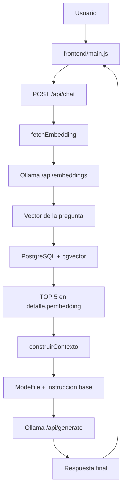

# 00_chatbot

## Introduccion

Este proyecto implementa un chatbot web con una interfaz estilo WhatsApp y un backend RAG local. El sistema recibe una pregunta del usuario, genera un embedding con Ollama, busca contexto semánticamente parecido en PostgreSQL usando pgvector y luego redacta la respuesta final con un modelo generativo.

Este desarrollo constituye una prueba de concepto o PoC orientada a visualizar el alcance que tiene Visual Studio Code con asistencia de IA para generar, reorganizar, documentar y ajustar un proyecto funcional de extremo a extremo.

Ficha del PoC:

- Nombre: 00_chatbot
- Tipo: prueba de concepto PoC
- Autor: Claudio Navarro Díaz
- Institución: Departamento de Informática de JUNAEB
- Fecha de creación: 21/04/2026 12:30
- Fecha de finalización: 22/04/2026 14:30
- Entorno principal de desarrollo: Visual Studio Code con asistencia de IA

El diseño busca mantener un flujo simple, auditable y ejecutable en local:

- Backend HTTP en Node.js + Express.
- Retrieval vectorial en PostgreSQL con pgvector.
- Embeddings y generación en Ollama.
- Reglas de seguridad y comportamiento cargadas desde Modelfile.
- Registro de actividad y errores en log.txt.

Puertos y servicios esperados:

- La aplicación web y el backend se sirven en http://localhost:4000.
- Ollama debe estar disponible en http://localhost:11434.
- PostgreSQL debe estar accesible con las credenciales definidas en .env o con los valores por defecto del proyecto.

## Vision general del RAG

RAG significa Retrieval-Augmented Generation. En este proyecto se divide en dos partes:


Dependencia para embeddings:

- Para la generación y gestión de embeddings este proyecto utiliza el repositorio `00_embedings`.
  `00_embedings` contiene scripts Node.js (`generate_resumen.js`, `generatepembeddings.js`, `genetarerembeddings.js`) que extraen resúmenes ligeros (keywords), generan embeddings mediante Ollama y almacenan los vectores en PostgreSQL. Los scripts procesan filas en lotes y actualizan columnas destino. Para más detalles y comandos de ejecución, consultar [00_embedings/readme.md](../00_embedings/readme.md).

El flujo principal ocurre en [00_chatbot/server.js](00_chatbot/server.js#L1) y sigue esta secuencia:

El flujo principal ocurre en [00_chatbot/server.js](00_chatbot/server.js#L1) y sigue esta secuencia:

1. El usuario escribe una pregunta en la interfaz.
2. [00_chatbot/frontend/main.js](00_chatbot/frontend/main.js#L1) envía POST /api/chat con el payload { "pregunta": "..." }.
3. El backend valida que pregunta sea un string no vacío.
4. La función fetchEmbedding(pregunta) solicita un embedding a Ollama.
5. El backend ejecuta una búsqueda vectorial en PostgreSQL sobre la tabla detalle.
6. Los resultados recuperados se convierten en un bloque de contexto con construirContexto(resultados).
7. generarRespuesta(contexto, pregunta) construye el prompt final incorporando Modelfile.
8. Ollama genera la respuesta final con el modelo generativo.
9. El backend responde al cliente con { "respuesta": "..." }.

Consulta vectorial usada por el retriever:

```sql
SELECT
  detalleconsulta,
  resumen,
  pembedding
FROM detalle
WHERE pembedding IS NOT NULL
ORDER BY pembedding <=> $1::vector
LIMIT 5;
```

Diagrama del flujo RAG:



## Componentes principales

- [00_chatbot/server.js](00_chatbot/server.js#L1): orquesta el pipeline RAG, sirve el frontend, valida la entrada, consulta la base de datos, llama a Ollama y escribe logs.
- [00_chatbot/frontend/index.html](00_chatbot/frontend/index.html#L1): define la estructura visual del chat.
- [00_chatbot/frontend/main.js](00_chatbot/frontend/main.js#L1): envía la pregunta al backend y renderiza los mensajes.
- [00_chatbot/frontend/style.css](00_chatbot/frontend/style.css#L1): define la estética de la pantalla.
- [00_chatbot/Modelfile](00_chatbot/Modelfile#L1): contiene reglas de seguridad, privacidad y comportamiento.
- [00_chatbot/log.txt](00_chatbot/log.txt#L1): almacena trazas operativas y errores.
- [00_chatbot/sql/sample_queries.sql](00_chatbot/sql/sample_queries.sql#L1): reúne consultas auxiliares para diagnosticar datos y embeddings.

## Modelos involucrados

Este proyecto usa dos modelos diferentes porque embeddings y generación resuelven tareas distintas.

### 1. Modelo de embeddings: nomic-embed-text

Funcion:

- Convierte la pregunta del usuario en un vector numérico.
- Permite comparar semánticamente la pregunta contra los embeddings almacenados en la base de datos.
- Se usa exclusivamente en la fase de retrieval.

Que es un vector numerico en este contexto:

- Un vector numérico es una lista ordenada de números decimales que representa el significado aproximado de un texto.
- En lugar de guardar la pregunta solo como palabras, el modelo la transforma en una coordenada dentro de un espacio matemático de muchas dimensiones.
- Cada posición del vector captura señales estadísticas y semánticas aprendidas por el modelo durante su entrenamiento.
- Dos textos con significado parecido tienden a producir vectores cercanos entre sí dentro de ese espacio.

Ejemplo simplificado:

```text
"quiero consultar un beneficio"
-> [0.12, -0.44, 0.91, 0.08, ...]
```

Ese ejemplo está simplificado. En la práctica el vector tiene muchas más dimensiones y por eso puede capturar relaciones semánticas que no son evidentes a simple vista.

Como se genera el vector:

1. El usuario envía una pregunta al endpoint /api/chat.
2. El backend llama a fetchEmbedding(pregunta) en [00_chatbot/server.js](00_chatbot/server.js#L1).
3. Esa función envía el texto al endpoint de Ollama /api/embeddings usando el modelo nomic-embed-text.
4. El modelo procesa el texto y devuelve un arreglo de números en data.embedding.
5. El backend convierte ese arreglo al formato esperado por pgvector para poder compararlo en PostgreSQL.

En otras palabras, el modelo no responde la pregunta. Su trabajo es convertir el texto en una representación matemática útil para búsqueda semántica.

Como se comparan los vectores:

- Una vez generado el vector de la pregunta, PostgreSQL lo compara con los vectores ya guardados en la columna pembedding.
- La idea es medir qué tan parecida es la dirección de dos vectores dentro del espacio vectorial.
- Si dos vectores apuntan a direcciones muy parecidas, los textos que representan suelen tener significado relacionado.

Explicacion del angulo coseno:

- La similitud por coseno compara el ángulo entre dos vectores.
- Si el ángulo es pequeño, el coseno se acerca a 1 y la similitud es alta.
- Si el ángulo es cercano a 90 grados, el coseno se acerca a 0 y la relación semántica es baja.
- Si el ángulo fuera opuesto, el coseno sería negativo y los vectores representarían contenidos muy distintos.

La fórmula general de similitud por coseno es:

$$
\cos(\theta) = \frac{A \cdot B}{\|A\|\,\|B\|}
$$

Donde:

- $A$ es el vector de la pregunta del usuario.
- $B$ es el vector almacenado de un registro de la base de datos.
- $A \cdot B$ es el producto punto entre ambos vectores.
- $\|A\|$ y $\|B\|$ son sus magnitudes.
- $\theta$ es el ángulo entre los dos vectores.

Interpretacion practica:

- Coseno cercano a 1: los textos son muy parecidos semánticamente.
- Coseno cercano a 0: los textos tienen poca relación semántica.
- Coseno negativo: los significados tienden a ser opuestos o poco compatibles.

Como aplica esto al proyecto:

- El backend obtiene el embedding de la pregunta actual.
- PostgreSQL compara ese vector con los embeddings almacenados en detalle.pembedding.
- La consulta ordena por cercanía vectorial y toma los 5 registros más relevantes.
- Esos 5 registros alimentan el contexto que luego usa el modelo generativo.

Nota sobre la implementación actual:

- En la consulta SQL del proyecto se usa el operador <=> de pgvector.
- Ese operador permite ordenar por distancia vectorial de manera eficiente dentro de PostgreSQL.
- Aunque en la explicación conceptual se habla del ángulo coseno para entender la similitud semántica, la implementación concreta depende del operador vectorial configurado y del tipo de comparación que provee pgvector para ese índice o consulta.

Caracteristicas relevantes:

- Está diseñado específicamente para tareas de embedding y búsqueda semántica.
- Funciona bien para representar significado textual en un espacio vectorial.
- Es adecuado para ejecución local con Ollama sin introducir un pipeline externo adicional.
- Mantiene el sistema simple: un solo proveedor local para inferencia.

Por que se elige este modelo:

- Porque un modelo de embeddings especializado produce mejores vectores para similitud que un LLM generalista.
- Porque encaja bien con pgvector y con el flujo de top-k similarity search.
- Porque reduce complejidad operativa frente a integrar servicios externos de embeddings.

Por que no se eligen otros:

- Un modelo generativo no es la mejor opción para retrieval vectorial.
- Modelos más pesados para embeddings pueden aumentar consumo y latencia sin una mejora proporcional para este caso educativo.
- Servicios externos añaden costo, dependencia de red y más variables de configuración.

### 2. Modelo generativo: deepseek-r1:8b

Funcion:

- Toma el contexto recuperado desde PostgreSQL.
- Recibe la pregunta original del usuario.
- Redacta una respuesta final restringida por el contexto y por las reglas de Modelfile.

Caracteristicas relevantes:

- Es un modelo generativo capaz de producir respuestas completas y naturales.
- Su tamaño 8b representa un equilibrio razonable entre calidad y ejecución local.
- Puede trabajar con instrucciones explícitas de seguridad y con contexto RAG inyectado en el prompt.
- Resulta adecuado para un chatbot local donde importa más la trazabilidad del flujo que una arquitectura compleja.

Por que se elige este modelo:

- Porque ofrece un balance práctico entre calidad de respuesta, consumo de memoria y tiempo de generación.
- Porque puede ejecutarse localmente con Ollama en un entorno educativo sin infraestructura adicional.
- Porque es suficiente para responder sobre contexto recuperado sin depender de una API remota.

Por que no se eligen otros:

- Modelos más grandes suelen exigir más RAM, más tiempo de respuesta y más recursos de hardware.
- Modelos más pequeños pueden degradar la redacción o seguir peor las instrucciones del prompt.
- Usar un solo modelo para todo el flujo no sería correcto: retrieval y generation tienen objetivos distintos.

## Como interviene Modelfile

El archivo [00_chatbot/Modelfile](00_chatbot/Modelfile#L1) no reemplaza al modelo ni se ejecuta como servicio aparte. Su función es definir reglas que el backend inyecta dentro del prompt final antes de llamar al modelo generativo.

Reglas principales que aporta:

- Protección de datos sensibles y privados.
- Rechazo de solicitudes inseguras o de evasión de seguridad.
- Prohibición de inventar información no presente en el contexto.
- Comportamiento conversacional esperado para el asistente.

Orden del prompt en [00_chatbot/server.js](00_chatbot/server.js#L1):

1. Reglas del sistema leídas desde Modelfile.
2. Instrucción técnica del backend: responder solo con el contexto.
3. Contexto recuperado desde PostgreSQL.
4. Pregunta del usuario.

Efecto práctico:

- El modelo no responde libremente.
- El modelo queda restringido por el contexto recuperado.
- El modelo además queda condicionado por reglas de seguridad y tono.

## Tablas y datos necesarios

La base de datos debe existir en PostgreSQL y contar con la extensión vector habilitada.

### Tabla usada directamente por el flujo actual

Tabla detalle:

- detalleconsulta: texto detallado que sirve como contenido recuperable.
- resumen: texto resumido que ayuda a condensar la semántica del registro.
- pembedding: vector almacenado previamente para la búsqueda por similitud.

Uso dentro del RAG:

- El backend consulta esta tabla en cada request de /api/chat.
- Solo se leen filas con pembedding no nulo.
- Los 5 resultados más cercanos se convierten en el contexto del prompt.

### Tablas mencionadas en el proyecto

Tabla respuesta:

- El README histórico y las consultas auxiliares la mencionan como parte del conjunto de datos.
- En la implementación actual de [00_chatbot/server.js](00_chatbot/server.js#L1), el endpoint /api/chat no la consulta ni la modifica.
- Puede seguir siendo útil en procesos auxiliares, diagnósticos o versiones anteriores del flujo.

### Que tablas modifica el sistema

En la implementación actual:

- El endpoint /api/chat no inserta, actualiza ni elimina filas en detalle ni en respuesta.
- El backend solo lee desde detalle para recuperar contexto.
- El arranque del servidor ejecuta CREATE EXTENSION IF NOT EXISTS vector, lo que prepara la capacidad vectorial de PostgreSQL pero no modifica datos funcionales del chatbot.
- El archivo log.txt sí se modifica continuamente porque registra la operación interna del sistema.

## Como se ve la pantalla en el navegador

La interfaz está pensada como una ventana de chat compacta y centrada, con estilo inspirado en aplicaciones de mensajería.

Vista de referencia basada en la captura:


Elementos visibles principales:

- Encabezado superior verde con el título Chatbot — Estilo WhatsApp.
- Área central grande para la conversación.
- Campo de texto inferior con el placeholder Escribe un mensaje....
- Botón Enviar alineado a la derecha.

Comportamiento esperado:

- El usuario escribe una pregunta y la envía.
- El frontend agrega la burbuja del usuario.
- Mientras espera la respuesta, muestra un mensaje temporal de estado.
- Cuando llega la respuesta, renderiza la burbuja final del bot.

Archivos responsables:

- [00_chatbot/frontend/index.html](00_chatbot/frontend/index.html#L1)
- [00_chatbot/frontend/main.js](00_chatbot/frontend/main.js#L1)
- [00_chatbot/frontend/style.css](00_chatbot/frontend/style.css#L1)
- [00_chatbot/assets/chatbot-screen.svg](00_chatbot/assets/chatbot-screen.svg#L1)

## API del chatbot

Endpoint principal:

```http
POST /api/chat
Content-Type: application/json
```

Request valido:

```json
{
  "pregunta": "Hola, quiero consultar un beneficio"
}
```

Response valida:

```json
{
  "respuesta": "Hola, cómo estás, espero que bien, dime cuál es tu consulta. [respuesta basada en el contexto recuperado]"
}
```

Request invalido:

```json
{
  "pregunta": ""
}
```

Response de validacion:

```json
{
  "error": "El campo pregunta es obligatorio"
}
```

Response cuando no hay contexto util:

```json
{
  "respuesta": "No tengo esa información"
}
```

## Requisitos e instalacion

Requisitos:

- Node.js 18 o superior.
- PostgreSQL operativo.
- Extensión pgvector disponible en PostgreSQL.
- Ollama corriendo con los modelos nomic-embed-text y deepseek-r1:8b.

Variables principales:

- PORT: puerto del backend, por defecto 4000.
- PGHOST, PGPORT, PGDATABASE, PGUSER, PGPASSWORD: conexión a PostgreSQL.
- OLLAMA_URL: URL base de Ollama.

Instalacion de Ollama en Windows:

Opción 1, instalacion directa con PowerShell:

```powershell
irm https://ollama.com/install.ps1 | iex
```

Opción 2, descarga manual:

- Descargar el instalador desde https://ollama.com/download/OllamaSetup.exe.
- Ejecutar el instalador en Windows 10 o superior.
- Iniciar Ollama desde el menú Inicio.

Verificacion basica:

```powershell
ollama -v
```

Instalacion de los modelos requeridos por este proyecto:

```powershell
ollama pull nomic-embed-text
ollama pull deepseek-r1:8b
```

Pruebas rapidas de disponibilidad:

```powershell
ollama list
ollama run deepseek-r1:8b
```

Tamaños aproximados de los modelos usados por el proyecto:

- nomic-embed-text: 274 MB descargados en disco.
- deepseek-r1:8b: 5.2 GB descargados en disco.

Espacio recomendado:

- Mínimo práctico para este proyecto: alrededor de 6 GB libres solo para los dos modelos.
- Recomendado para operar con margen, actualizaciones, manifiestos y blobs: al menos 8 a 10 GB libres en la unidad donde quede .ollama.
- Si se usarán más modelos o varias versiones, conviene reservar más espacio.

Como mover el almacenamiento de Ollama a otra unidad con un enlace simbolico:

Por defecto, Ollama guarda sus modelos en Windows en C:\Users\%username%\.ollama\models. Si el disco C: tiene poco espacio, una opción práctica es mover toda la carpeta .ollama a D: y dejar un enlace simbólico en la ruta original.

Ejemplo deseado:

- Ruta visible para Ollama: C:\Users\usuario\\.ollama
- Ruta real de almacenamiento: D:\ollama\\.ollama

Pasos recomendados:

1. Cerrar completamente Ollama desde el área de notificación de Windows.
2. Verificar que no quede ejecutándose en segundo plano.
3. Crear la carpeta destino en D:.
4. Mover el contenido de C:\Users\usuario\.ollama hacia D:\ollama\.ollama.
5. Crear el enlace simbólico en la ubicación original.

Comandos en PowerShell:

```powershell
New-Item -ItemType Directory -Path D:\ollama -Force
Move-Item -Path C:\Users\usuario\.ollama -Destination D:\ollama\.ollama
New-Item -ItemType SymbolicLink -Path C:\Users\usuario\.ollama -Target D:\ollama\.ollama
```

Alternativa en CMD con privilegios de administrador:

```cmd
mklink /D C:\Users\usuario\.ollama D:\ollama\.ollama
```

Verificacion del enlace:

```powershell
Get-Item C:\Users\usuario\.ollama | Format-List FullName,LinkType,Target
```

Nota importante:

- Reemplazar usuario por el nombre real de la cuenta de Windows.
- Si la carpeta original ya existe, primero debe estar movida o eliminada antes de crear el enlace.
- Como alternativa oficial, Ollama también permite usar la variable de entorno OLLAMA_MODELS para mover el almacenamiento de modelos a otro directorio.

Subcarpetas y archivos habituales dentro de .ollama:

La estructura puede variar levemente según la versión de Ollama, pero en una instalación típica encontrarás estos elementos:

- models: carpeta principal donde se almacenan los modelos descargados.
- models\blobs: contiene los blobs binarios grandes de los modelos. Aquí se consume la mayor parte del espacio en disco.
- models\manifests: contiene manifiestos y metadatos que describen qué blobs componen cada modelo o etiqueta.
- id_ed25519: clave privada local usada por Ollama para ciertas funciones de autenticación o publicación.
- id_ed25519.pub: clave pública local asociada a la instalación.
- server.json: archivo de configuración local cuando se usan opciones como desactivar funciones cloud.

Funcion de cada subcarpeta principal:

- blobs: guarda el peso real de los modelos, por eso crece rápidamente con cada descarga.
- manifests: registra referencias, versiones y composición lógica de los modelos descargados.
- models: actúa como contenedor general del repositorio local de modelos.

Que conviene respaldar o mover:

- Si el objetivo es liberar espacio, lo importante es mover toda la carpeta .ollama o, como mínimo, la carpeta donde residen los models.
- Si se quiere preservar por completo el estado local de Ollama, conviene mover la carpeta .ollama completa y no solo una subcarpeta aislada.

Instalacion de Node.js en Windows:

Opción 1, usando winget:

```powershell
winget install OpenJS.NodeJS.LTS
node -v
npm -v
```

Opción 2, usando nvm-windows para gestionar versiones:

```powershell
winget install CoreyButler.NVMforWindows
nvm install 18.20.8
nvm use 18.20.8
node -v
npm -v
```

Opción 3, descarga manual:

- Descargar el instalador LTS desde https://nodejs.org
- Ejecutar el instalador MSI.
- Abrir una terminal nueva y verificar con node -v y npm -v.

Instalacion:

```bash
cd 00_chatbot
cp .env.example .env
npm install
npm start
```

Uso:

- Abrir http://localhost:4000 en el navegador.
- Escribir una pregunta en la interfaz.
- El backend generará el embedding, recuperará contexto y devolverá la respuesta final.

## Troubleshooting

### 1. Ollama no responde

Sintomas:

- npm start falla al intentar generar embeddings o respuesta.
- El backend devuelve errores 500.
- [00_chatbot/log.txt](00_chatbot/log.txt#L1) contiene fallos de embedding o generación.

Que revisar:

- Que Ollama esté corriendo en http://localhost:11434.
- Que existan los modelos nomic-embed-text y deepseek-r1:8b.
- Que OLLAMA_URL esté correctamente configurada.

### 2. PostgreSQL o pgvector fallan

Sintomas:

- El servidor no arranca.
- npm start termina con código 1.
- El log muestra errores de conexión o de query vectorial.

Que revisar:

- Credenciales de PostgreSQL.
- Existencia de la base de datos configurada.
- Disponibilidad de la extensión vector.
- Existencia de la tabla detalle y de la columna pembedding.

### 3. El retriever no encuentra contexto útil

Sintomas:

- El sistema responde No tengo esa información con demasiada frecuencia.
- Las filas recuperadas no representan la consulta del usuario.

Que revisar:

- Calidad de detalleconsulta y resumen.
- Coherencia entre el modelo usado para generar embeddings almacenados y el modelo actual.
- Presencia de embeddings no nulos en detalle.

### 4. Modelfile no parece aplicarse

Sintomas:

- El bot ignora reglas de seguridad o tono.
- El saludo o la conducta esperada no aparecen.

Que revisar:

- Existencia y contenido de [00_chatbot/Modelfile](00_chatbot/Modelfile#L1).
- Carga correcta del archivo en [00_chatbot/server.js](00_chatbot/server.js#L1).
- Registros correspondientes en [00_chatbot/log.txt](00_chatbot/log.txt#L1).

## Consultas utiles de diagnostico

Conteo de embeddings faltantes en detalle:

```sql
SELECT count(*)
FROM detalle
WHERE detalleconsulta IS NOT NULL
  AND pembedding IS NULL;
```

Conteo de embeddings faltantes en respuesta:

```sql
SELECT count(*)
FROM respuesta
WHERE respuestafinaltxt IS NOT NULL
  AND rembedding IS NULL;
```

Estas consultas están alineadas con [00_chatbot/sql/sample_queries.sql](00_chatbot/sql/sample_queries.sql#L1).

## Prompts principales utilizados en la realizacion

Los siguientes prompts resumen las instrucciones principales empleadas durante la construcción y ajuste de este PoC. Se incluyen porque forman parte del enfoque experimental de desarrollo asistido por IA.

Prompt de especificación técnica del backend RAG:

```text
Requisitos técnicos obligatorios:

1) Embeddings:
- Usar modelo: "nomic-embed-text"
- Endpoint: POST http://localhost:11434/api/embeddings
- Body: { model, prompt }

2) Base de datos:
- PostgreSQL con extensión pgvector
- Tabla: detalle(detalleconsulta TEXT, resumen TEXT, pembedding VECTOR)
- Tabla: respuesta(respuestafinaltxt TEXT, rembedding VECTOR)
- Consulta de similitud:
  ORDER BY embedding <=> $1
  LIMIT 5

3) Recuperación (Retriever):
- ya existe embedding de la pregunta del usuario en Tabla: detalle(pembedding VECTOR)
- Consultar PostgreSQL
- Obtener top_k = 5 resultados más similares

4) Construcción de contexto:
- Unir los 5 resultados en un string
- Separar cada bloque con doble salto de línea

5) Generación (LLM):
- Modelo: "deepseek-r1:8b"
- Endpoint: POST http://localhost:11434/api/generate
- NO usar deepseek para embeddings
- Prompt debe incluir:
  - instrucción clara
  - contexto
  - pregunta

6) Reglas del prompt:
- Responder SOLO usando el contexto
- No inventar información
- Si no está en el contexto: responder "No tengo esa información"

7) API:
- Crear endpoint POST /api/chat
- Recibir { pregunta }
- Retornar { respuesta }
```

Prompts de observabilidad, seguridad y documentación:

```text
Agrega un log.txt en donde se registre todo lo que está haciendo internamente el sistema, también los errores
debe aplicar las reglas de seguridad y comportamiento del archivo Modelfile
agrega un comentario en cada función con su descripción, también en cada if, for, const, await, fetch
si el readme.md no tiene la información de cómo funciona el RAG en este proyecto, incorpóra esta descripción indicando los archivos y el flujo con diagrama vectorial
haz los tres puntos
```

Prompts de documentación visual y refinamiento final:

```text
Agrega un apartado de cómo se ve la pantalla en el navegador
crea una vista SVG basada en la captura y la insertaré en la sección de la pantalla para que el README la muestre directamente
Diagrama del flujo RAG: que sea vertical, no horizontal porque horizontal las imagenes quedan muy pequeñas
en 1. Modelo de embeddings: nomic-embed-text, explica claramente qué es un vector numérico, cómo se genera y cómo se compara el angulo cosine
```

Estos prompts muestran que el proyecto no solo prueba un chatbot RAG local, sino también una forma de trabajo asistida por IA en la que la especificación técnica, la observabilidad, la seguridad, la documentación y la presentación visual pueden evolucionar en ciclos muy cortos dentro del editor.

## Conclusion

Este proyecto implementa un RAG local, simple y verificable. nomic-embed-text se encarga de representar la pregunta como vector para recuperar contexto útil desde PostgreSQL, mientras deepseek-r1:8b transforma ese contexto en una respuesta legible y restringida por reglas de seguridad. La tabla crítica del flujo actual es detalle, porque allí reside el contenido indexado para retrieval; la tabla respuesta puede seguir existiendo como apoyo de datos, pero no participa en el endpoint actual.

La arquitectura fue elegida por equilibrio: modelos locales, integración directa con Ollama, retrieval con pgvector, backend pequeño en Express y trazabilidad mediante log.txt. Eso la hace apropiada para aprendizaje, depuración y evolución incremental del chatbot.

Como PoC, su valor no está solo en el resultado técnico, sino también en demostrar que Visual Studio Code con asistencia de IA puede acelerar la construcción de una solución completa: backend, integración con modelos, documentación técnica, material visual y refinamiento iterativo a partir de prompts cada vez más específicos.